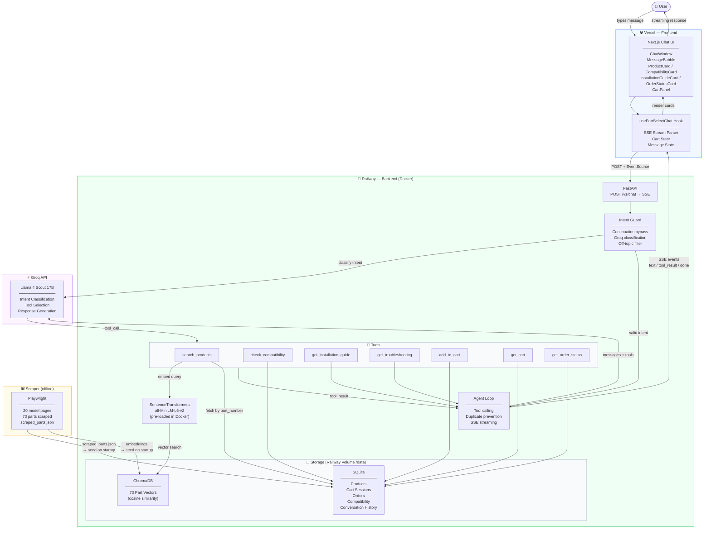

```mermaid
graph TB
    User(["👤 User"])

    subgraph Vercel["🌐 Vercel — Frontend"]
        UI["Next.js Chat UI<br/>─────────────<br/>ChatWindow<br/>MessageBubble<br/>ProductCard / CompatibilityCard<br/>InstallationGuideCard / OrderStatusCard<br/>CartPanel"]
        Hook["usePartSelectChat Hook<br/>─────────────<br/>SSE Stream Parser<br/>Cart State<br/>Message State"]
    end

    subgraph Railway["🚂 Railway — Backend (Docker)"]
        API["FastAPI<br/>POST /v1/chat → SSE"]

        Guard["Intent Guard<br/>─────────────<br/>Continuation bypass<br/>Groq classification<br/>Off-topic filter"]

        Agent["Agent Loop<br/>─────────────<br/>Tool calling<br/>Duplicate prevention<br/>SSE streaming"]

        subgraph Tools["🔧 Tools"]
            T1["search_products"]
            T2["check_compatibility"]
            T3["get_installation_guide"]
            T4["get_troubleshooting"]
            T5["add_to_cart"]
            T6["get_cart"]
            T7["get_order_status"]
        end

        subgraph Storage["💾 Storage (Railway Volume /data)"]
            SQLite["SQLite<br/>─────────────<br/>Products<br/>Cart Sessions<br/>Orders<br/>Compatibility<br/>Conversation History"]
            Chroma["ChromaDB<br/>─────────────<br/>73 Part Vectors<br/>(cosine similarity)"]
        end

        Embed["SentenceTransformers<br/>all-MiniLM-L6-v2<br/>(pre-loaded in Docker)"]
    end

    subgraph Groq["⚡ Groq API"]
        LLM["Llama 4 Scout 17B<br/>─────────────<br/>Intent Classification<br/>Tool Selection<br/>Response Generation"]
    end

    subgraph Scraper["🕷️ Scraper (offline)"]
        PW["Playwright<br/>─────────────<br/>20 model pages<br/>73 parts scraped<br/>scraped_parts.json"]
    end

    User -->|"types message"| UI
    UI --> Hook
    Hook -->|"POST + EventSource"| API
    API --> Guard
    Guard -->|"classify intent"| LLM
    Guard -->|"valid intent"| Agent
    Agent -->|"messages + tools"| LLM
    LLM -->|"tool_call"| Tools
    T1 -->|"embed query"| Embed
    Embed -->|"vector search"| Chroma
    T1 -->|"fetch by part_number"| SQLite
    T2 & T5 & T6 & T7 --> SQLite
    T3 & T4 --> Agent
    Tools -->|"tool_result"| Agent
    Agent -->|"SSE events<br/>text / tool_result / done"| Hook
    Hook -->|"render cards"| UI
    UI -->|"streaming response"| User
    PW -->|"scraped_parts.json<br/>→ seed on startup"| SQLite
    PW -->|"embeddings<br/>→ seed on startup"| Chroma

    style Vercel fill:#f0f7ff,stroke:#3b82f6
    style Railway fill:#f0fff4,stroke:#22c55e
    style Groq fill:#fdf4ff,stroke:#a855f7
    style Scraper fill:#fffbeb,stroke:#f59e0b
    style Tools fill:#f8fafc,stroke:#94a3b8
    style Storage fill:#f8fafc,stroke:#94a3b8
```
